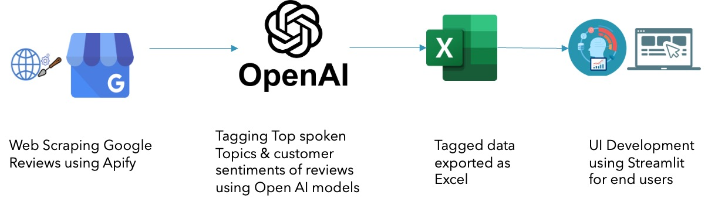

# Overview
This repository features Leveraging Large Language Models, Sentiment Analytics (Tagging reviews, Grouping reviews based on topics, extracting relevant phrases) & app development.

## About:
This is a deployable Web application that aids with the analysis on Voice of the customer from Google Maps Reviews.

#### This app provides insights on the following:
> Market Buzz: What is that people are talking about?  

> Customer Experience: What are the Delight Factors & Pain Points? 

> Product Offering: What do people say on the Product Offerings? 

> Brand Reputation: How the brand fairs from the lens of a customer? 

> Competitive Advantage: Where do we stand amidst competition? 

### Architecture:

- Web Scraping  
- Leveraging LLM for extracting information  
- Structuring the LLM response  
- App development for Visualization  

### Dataset:  
The dataset is derived from Google Maps reviews that is available open source on maps.google.com. 
I have considered certain top jewellery brands from USA & GCC market for my analysis. 
The data is web scraped using Google Maps Reviews Scraper created by Compass and maintained by Apify.
**This data is opensource and publicly available**

### How to use this repository?
> Fork this to your repository  
> Clone your forked repo to your local  
`git clone 

